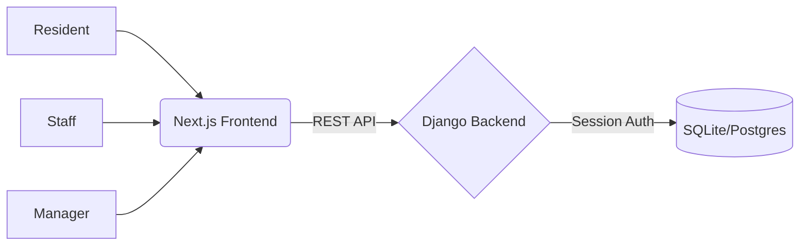

# DispatchPro - Maintenance Dispatch System

A production-ready Maintenance Dispatch System built with Django (Backend) and Next.js (Frontend).

## 🚀 Overview

DispatchPro is a secure, role-based management system designed for property managers, maintenance staff, and residents. It features strict server-side permissions and a modern, high-fidelity dashboard.

## 🔧 Tech Stack

- **Backend**: Django + Django REST Framework (DRF)
- **Frontend**: Next.js 14+ (App Router)
- **Authentication**: Session-based with Cookies (Secure & HttpOnly in production)
- **Styling**: Vanilla CSS (Modern, Premium Aesthetics)
- **Security**: CSRF Protection + Role-Based Access Control (RBAC)

## 🔐 Security Features

- **Session-Based Auth**: Uses Django's robust session management instead of JWTs, ensuring centralized session control.
- **CSRF Protection**: Native Django CSRF tokens are handled securely between the decoupled frontend and backend.
- **Permission Strategy**: 
  - **Managers**: Full access to all maintenance requests and staff assignment.
  - **Staff**: Can only view assigned tasks and update their status.
  - **Residents**: Can only create requests and track their own history.
- **Row-Level Security**: Implemented at the API level via custom `get_queryset` and Permission Classes in Django.

## 🏗️ Architecture

## 📦 Getting Started

### Backend Setup
1. `cd backend`
2. `python -m venv venv`
3. `source venv/bin/activate` (or `venv\Scripts\activate`)
4. `pip install -r requirements.txt` (or manually install django, djangorestframework, django-cors-headers)
5. `python manage.py migrate`
6. `python seed_users.py` (to create demo accounts)
7. `python manage.py runserver`

### Frontend Setup
1. `cd frontend`
2. `npm install`
3. `npm run dev`

### Demo Credentials
- **Manager**: `manager1` / `manager123`
- **Staff**: `staff1` / `staff123`
- **Resident**: `resident1` / `resident123`

## 🌍 Deployment

The system is designed for production readiness:
- `CORS_ALLOWED_ORIGINS` and `CSRF_TRUSTED_ORIGINS` are configurable.
- `Gunicorn` or `Uvicorn` can be used for served production.
- Environment variables handle sensitive data like `SECRET_KEY`.
